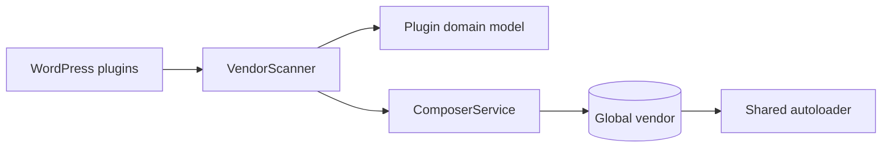

# Package Unifier

Experimental WordPress utility for exploring **shared Composer dependency management across multiple plugins**.

> **Status:** engineering experiment / proof of concept. The repository is intentionally public as a source-level example, but the current implementation should be reviewed and hardened before production use.

## Problem

WordPress installations can contain several plugins that ship overlapping Composer dependencies inside their own `vendor/` directories. Package Unifier explores a different model: scan plugin dependencies and consolidate compatible packages behind a shared vendor/autoload boundary.

## Current architecture



The code is separated into:

- `src/Domain` — plugin/package models.
- `src/Application` — scanning, dependency installation and autoloader orchestration.
- `src/Infrastructure` — Composer and WordPress integration.
- `src/Shared` — shared configuration.
- `package-unifier.php` — WordPress bootstrap/integration entrypoint.

## Requirements

- PHP 8+
- WordPress
- Composer CLI available to the runtime

Install PHP dependencies with:

```bash
composer install
```

## Design intent

The experiment investigates:

- reducing duplicated Composer packages across plugins;
- centralizing dependency discovery;
- preserving a fallback path when the shared autoloader is unavailable;
- separating WordPress integration from application/domain responsibilities.

## Important limitations

Shared dependency trees across independently versioned WordPress plugins create hard compatibility problems. A production implementation would need, at minimum:

- explicit semantic-version conflict resolution;
- transactional/rollback behavior;
- filesystem permission and failure handling;
- stronger process-execution isolation;
- automated unit/integration coverage;
- deterministic handling of plugin activation/deactivation;
- a migration strategy for plugins that assume a local `vendor/`;
- removal of generated/vendor artifacts from source control where appropriate.

This repository should therefore be read as an **architecture and dependency-management experiment**, not as a drop-in production plugin.

## License

MIT
